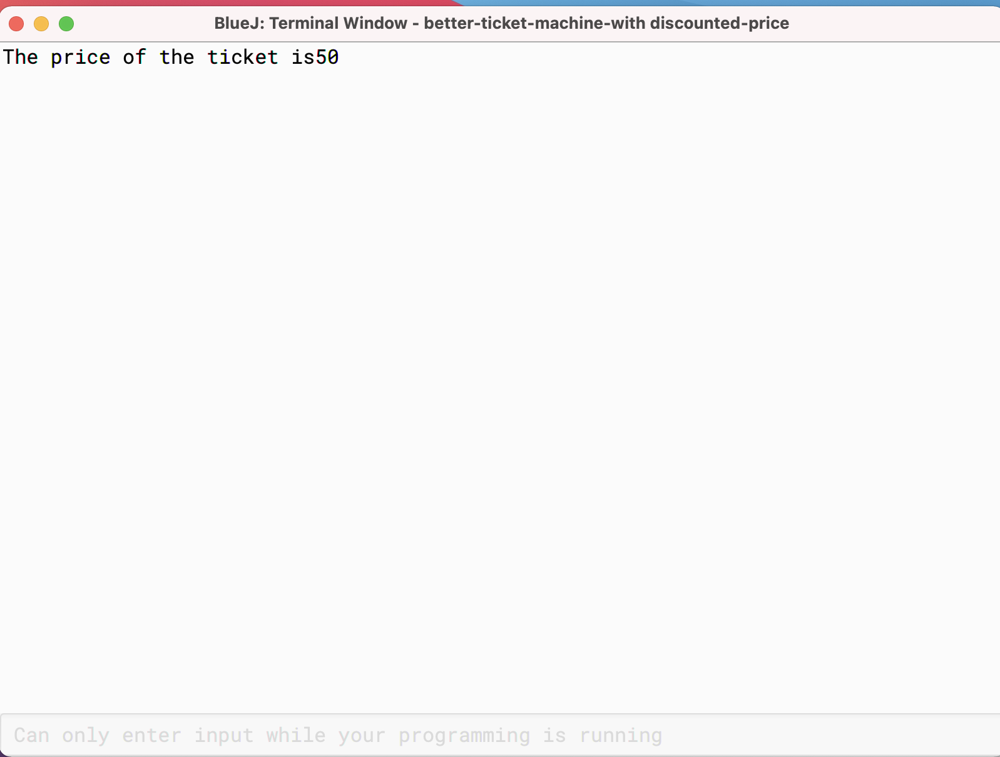

## Ticket Machine

## Introduction
TicketMachine project models a ticket machine that issues
flat-fare tickets.Its a BlUEJ Project.
The price of a ticket is specified via the constructor.
Instances will check to ensure that a user only enters
sensible amounts of money, and will only print a ticket
if enough money has been input.

### Prerequisites
* BLUEJ 4.2.2.

## ScreenShots

## Create NewTicket Machine

## Functions Of TicketMachine

## EmptyMachine

## Insert Money

## Get price

## Get Balance

## PriceList

## PrintTicket

## RefundBalance

## ShowPrice

## Total

